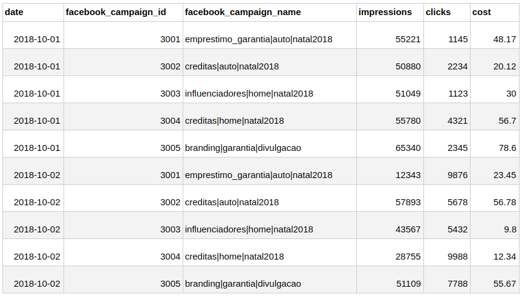
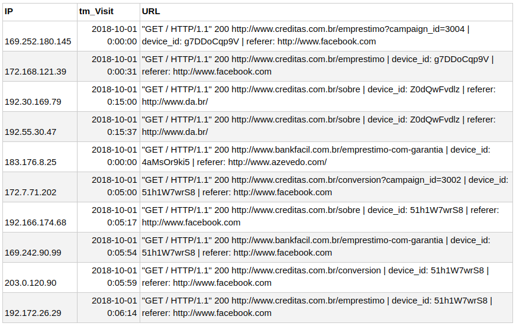
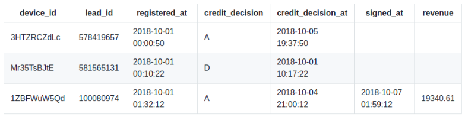
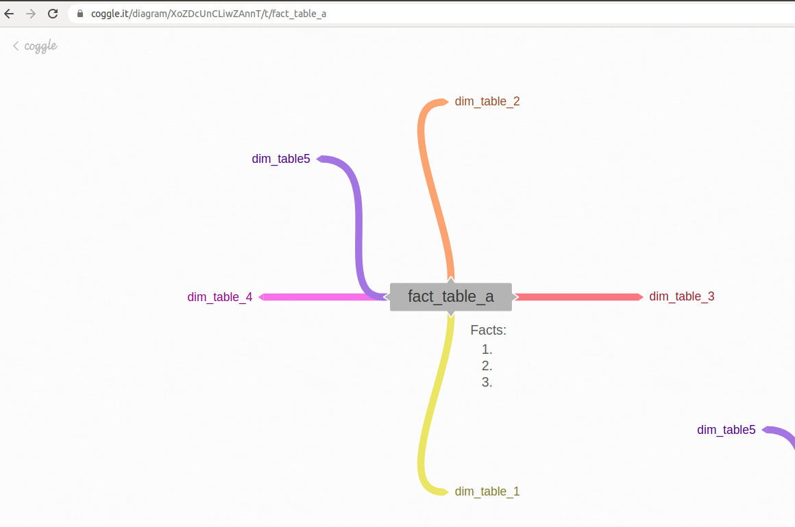

# Creditas Analytics Data Marts Challenge

### AVISO SOBRE O TESTE SER EM INGLÊS

Esse teste está em inglês pois acreditamos que a leitura em inglês é parte do dia a dia das pessoas em tecnologia. Se você não domina totalmente a língua isso não é de forma alguma um problema. Se precisar de ajuda para esclarecer algum ponto que não ficou claro, não hesite em nos perguntar. :blush:

## Introduction

Hi! We're glad to know you intend to work with us in the Creditas Data Marts team. It means a lot you're taking time to do this data modeling assignment! :smiley:

This challenge mimics a task we ourselves deal with on a daily basis and it was designed to assess your business intelligence skills. We expect you to deliver a professional solution, taking into account integration, extensibility and ease of understanding. 
 
## The problem: digital media effectiveness

### A little bit on digital marketing

Digital Marketing is all about attracting new customers using online tools, such as facebook, google search, LinkedIn, and others. All these platforms provide paid capabilities for companies willing to advertise their products to potential customers. In short, digital marketing is just like traditional marketing but using digital media instead of physical ones (like newspapers, magazines, outdoors). Also, a key difference between them is that with digital media it is possible to track user engagement and adjust the marketing strategy accordingly, optimizing the money spent with marketing.

This challenge is about preparing data to analyze digital media effectiveness on our business. If you know nothing about digital marketing that's fine, you're not supposed to and previous knowledge in this matter is not needed. Here are some of the key digital marketing concepts:

- *Campaign*: a marketing campaign is a series of coordinated advertising actions intended to target a specific group of potential customers;
- *Ad Creative*: a graphical image or video that conveys the message being advertised;
- *Ad Impressions*: one single occurrence of displaying an ad to a potential customer;
- *Clicks*: one single click on the ad that leads the customer to the company's website;
 

### Creditas conversion funnel

We can look at the path the customers go from getting to know our company to converting into a customer as a multi-step process funnel. It is a funnel because for each further step we look, we will progressively find less people involved. The following image illustrates a very simplified version of the conversion funnel we have here at Creditas.

Initially the customer is unaware of our product, the goal of digital marketing is attract potential customers into the conversion funnel. After the customer fills out a lead form (that means he/she is interested), we will run the credit analysis and then formalize the operation signing the contract.

The operation may not be completed by many reasons, such as:

- the customer is not approved in credit analysis;
- the customer is suspected of being a fraud;
- the customer loses interest and quits the process.
 
### The data

There are 4 different datasets to handle and integrate. They are all made up, it's not real data.

**1. google_ads_media_costs**

This dataset contains ad campaign costs from Google Ads Platform.

Sample:

**2. facebook_ads_media_costs**

This dataset contains ad campaign costs from Facebook Ads Platform. It is very similar to the previous, but does not provide the ad creative id information.

Sample:

**3. pageviews.txt**

This file comes from the web server logs and provides pageviews information about a customer visiting our website. It is a purely text file so to extract information from it you have to parse each line and capture just what is needed.

Sample:
 

From the URL address you can find the ad_creative_id and the campaign_id. Also the referer indicates where it came from, whether from Google Ads (http://google.com.br), Facebook Ads (http://www.facebook.com) or organic traffic (anything else).

**4. customer_leads_funnel**

This dataset contains data about leads.

Keep in mind that "lead" is an interested person, which may or may not become a customer. The lead becomes a customer when he/she signs the contract.

Please note that in the column credit_decision, an A stands for Approved and a D stands for Denied. Also, you will notice that even if a customer is approved he/she may give up and don't sign the contract; which, in turn, will generate no revenue.
 
## What the user needs to answer

The digital marketing team is a highly data driven and results oriented team. They need you to prepare the analytical database/tables where they will perform queries to answer the following business questions:

- What was the most expensive campaign?
- What was the most profitable campaign?
- Which ad creative is the most effective in terms of clicks?
- Which ad creative is the most effective in terms of generating leads?
  

## What you need to do

- Define the fact tables and the dimensions needed to model the dataset presented. The goal is to answer the questions above and be able to see how you have used fact and dimensions conformation concepts in order to answer them.
- Describe the granularity of the fact and dimension tables;
- The data model should combine information about:
  - Costs of digital marketing campaigns over a given period; 
  - Web traffic x campaigns;
  - Revenue derived from digital marketing campaigns over a given period.

## How to deliver your solution

Please send us a Google or Microsoft email so that we can share with you a mind map template in which you will design a simplified dimensional data model for the challenge proposed.

You will receive an invite email to edit this model in the https://coggle.it/ website. 

A dashboard like the image below will be available for you to edit as you wish:

You will design this simplified data model in front of a small audience. 

The presentation structure will be: 30 minutes for data model design + 20 minutes for Q&A from the audience + 10 min for questions you may have. 
 
## Hints about us
- We use Kimball’s approach to design our data warehouse;
- We expect your data model design to be clean and of ease understanding.
 
