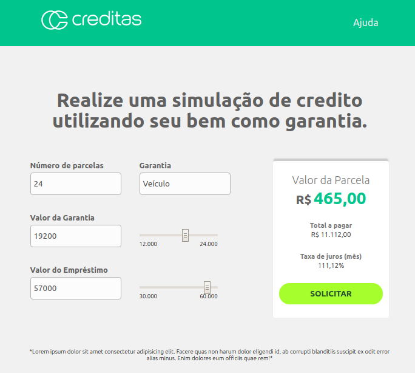

# Frontend Challenge - Creditas
This is a placement test. We would like to clarify that we don't expect everyone to fullfill it in its whole since it is meant for every career level. We hope all the people who would like to work with us make an attempt.

In this challenge, we focus on code design and design patterns in Javascript. The goal is to assess your experience in writing **code that is easy to maintain, loosely coupled and highly cohesive**.

Creditas likes to work with constructive feedbacks, therefore we will pay special attention to everyone's solution. We will contact you about the positive aspects of your test, as well as what you could improve in it. It is worth trying! :)

## The problem

You have to improve the loan simulation calculator that is implemented in this project.

The interface is previously given, as well as the styles. The challenges include refactoring the code and implenting new functionalities (listed below).

Feel free to componentize what you think should be componentized. Our only request is that you use only pure Javascript, our beloved Vanilla. How do you like that?

The calculator's current state:



### Expected functionalities

The application must allow user to choose the collateral type they want to use in their equity loan simulation:
***"Auto"*** or ***"Home"*** (the default option is ***"Auto"*** ).

It should also follow the calculation rules bellow:

**Common Rules**
- Financial Transaction Tax (FTT): 6.38%;
- Interest Rate: 2.34%;
- Maximum loan-to-value (amount the user can borrow): 80% of the collateral's value;

*Total Loan Payments Formula*

```javascript
const totalLoanPayments = ((FTT / 100) + (interestRate / 100) + (termInMonths / 1000) + 1) * loanAmount
```

*Monthly payment formula*

```javascript
const monthlyPayment = totalLoanPayments / termInMonths
```

## Challenges to achieve

### CSS
* **Refactor to make maintainance easier** 

Currently, the project's CSS file has too many styles, making readability difficult. We expect you to organize styles, isolating it in order to make them more readable and easier to maintain.

### HTML / JS
* **Add new collateral type _"Home"_** (with its calculation rules) 
* **Refactor the code, organizing it to make maintainance easier** 

Currently, Creditas offers two products: home equity loan and auto equity loan. This project implements only the *"auto equity"* option and you must implement the *"home equity"* option.
By changing the collateral type in the `select` element, the user must see the amount and term options corresponding to the chosen product. That is, by selecting home or auto, you must show different options on the form fields and on the slider. Find the corresponding values below:

**Auto**
- Minimum loan amount: R$ 3.000,00;
- Maximum loan amount: R$ 100.000,00;
- Terms: 24 / 36 / 48 months

**Home**
- Minimum loan amount: R$ 30.000,00;
- Maximum loan amount: R$ 4.500.000,00;
- Terms: 120 / 180 / 240 months

Finally, you must show the monthly payment value in its respective field with each change in the form inputs.

## Development

### Prerequisite
You'll need to have at least [NodeJs](https://nodejs.org/en/) installled to run the application and [Git](https://git-scm.com/book/en/v2/Getting-Started-Installing-Git) installled to clone the repository and submit a pull request.

### Configuration to run the environment
You need to know a little of Git, which is the tool that helps us controlling our files' versioning.

```shell
git clone https://github.com/Creditas/challenge.git
cd frontend/
npm install
npm start
```

If everything is correct, access the following URL: [http://localhost:4000/](http://localhost:4000/).

### Built with
This project uses some libraries to assist us with tests and running the application. Those are: *Webpack*, *Babel*, *Jest* and *Eslint*.

## Tests

To run the tests you must execute the following command:

```shell
npm test
```

## Feedback (optional)
Here at Creditas feedbacks are part of our culture, so it would be very rewarding if you could contribute with our hiring process by giving us your opinions on the challenge. We would like you to send it even if you didn't finish the challenge.
