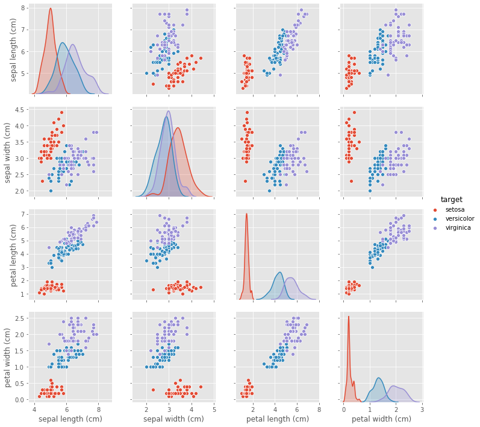

```python
# Let me provide the context first!
# This is a exercise that simulates the real thing, the interaction between Data Science and 
# Machine Learning teams, in a small scale of course, but you will get the point :))

# These are the roles:
# 1) I'm Lisa, the Machine Learning Team Leader, and I'm a facilitator.
# 2) Brunno is a Data Scientist and it is working on a very clever model that's going to change the world and 
# make the Business Unit very happy. This model is a classifier which uses 4 features (input variables) to define 
# an output.
# 3) You are our Machine Learning Engineer and has a mixed hard-skills such as coding software, machine learning
# and DevOps. 

# Data Science cycle is commonly divided into 4 steps:
# 1. Business understanding
# 2. Data acquisition and understanding (includes capture, preparation, wrangling, exploration and cleaning)
# 3. Modeling (includes Feature engineering, model training and evaluation) 
# 4. Model deployment into production (includes scoring, performance monitoring etc)
# More info available on: 
# https://docs.microsoft.com/en-us/azure/machine-learning/team-data-science-process/overview

# As a Machine Learning Engineer you are committed to productize ML models and make life easier for DS team. 
# Challenge is going to prepare you to make the right decisions so that the transition from step 3 to step 4 
# occurs smoothly. 
# It means you need to pick up the model made at step 3 and put it into production on step 4.
```


```python
# Beginning of the DS journey... bear in mind you don't need touch anything here, but it is a good thing 
# to understand this snippet of code
```


```python
# import all important stuff
import numpy as np
import pandas as pd
import matplotlib.pyplot as plt
import seaborn as sns

from sklearn.datasets import load_iris
from sklearn.ensemble import RandomForestClassifier
from sklearn.metrics import accuracy_score
from sklearn.model_selection import train_test_split
```


```python
# loading the Iris dataset
iris = load_iris()
X = iris.data
y = iris.target
```


```python
# more about this dataset: https://en.wikipedia.org/wiki/Iris_flower_data_set

# visualize what'is inside
pd_iris = pd.DataFrame(data= np.c_[iris['data'], iris['target']],
                     columns= iris['feature_names'] + ['target'])
pd_iris
```


<div>

<table border="1" class="dataframe">
  <thead>
    <tr style="text-align: right;">
      <th></th>
      <th>sepal length (cm)</th>
      <th>sepal width (cm)</th>
      <th>petal length (cm)</th>
      <th>petal width (cm)</th>
      <th>target</th>
    </tr>
  </thead>
  <tbody>
    <tr>
      <th>0</th>
      <td>5.1</td>
      <td>3.5</td>
      <td>1.4</td>
      <td>0.2</td>
      <td>0.0</td>
    </tr>
    <tr>
      <th>1</th>
      <td>4.9</td>
      <td>3.0</td>
      <td>1.4</td>
      <td>0.2</td>
      <td>0.0</td>
    </tr>
    <tr>
      <th>2</th>
      <td>4.7</td>
      <td>3.2</td>
      <td>1.3</td>
      <td>0.2</td>
      <td>0.0</td>
    </tr>
    <tr>
      <th>3</th>
      <td>4.6</td>
      <td>3.1</td>
      <td>1.5</td>
      <td>0.2</td>
      <td>0.0</td>
    </tr>
    <tr>
      <th>4</th>
      <td>5.0</td>
      <td>3.6</td>
      <td>1.4</td>
      <td>0.2</td>
      <td>0.0</td>
    </tr>
    <tr>
      <th>5</th>
      <td>5.4</td>
      <td>3.9</td>
      <td>1.7</td>
      <td>0.4</td>
      <td>0.0</td>
    </tr>
    <tr>
      <th>6</th>
      <td>4.6</td>
      <td>3.4</td>
      <td>1.4</td>
      <td>0.3</td>
      <td>0.0</td>
    </tr>
    <tr>
      <th>7</th>
      <td>5.0</td>
      <td>3.4</td>
      <td>1.5</td>
      <td>0.2</td>
      <td>0.0</td>
    </tr>
    <tr>
      <th>8</th>
      <td>4.4</td>
      <td>2.9</td>
      <td>1.4</td>
      <td>0.2</td>
      <td>0.0</td>
    </tr>
    <tr>
      <th>9</th>
      <td>4.9</td>
      <td>3.1</td>
      <td>1.5</td>
      <td>0.1</td>
      <td>0.0</td>
    </tr>
    <tr>
      <th>10</th>
      <td>5.4</td>
      <td>3.7</td>
      <td>1.5</td>
      <td>0.2</td>
      <td>0.0</td>
    </tr>
    <tr>
      <th>11</th>
      <td>4.8</td>
      <td>3.4</td>
      <td>1.6</td>
      <td>0.2</td>
      <td>0.0</td>
    </tr>
    <tr>
      <th>12</th>
      <td>4.8</td>
      <td>3.0</td>
      <td>1.4</td>
      <td>0.1</td>
      <td>0.0</td>
    </tr>
    <tr>
      <th>13</th>
      <td>4.3</td>
      <td>3.0</td>
      <td>1.1</td>
      <td>0.1</td>
      <td>0.0</td>
    </tr>
    <tr>
      <th>14</th>
      <td>5.8</td>
      <td>4.0</td>
      <td>1.2</td>
      <td>0.2</td>
      <td>0.0</td>
    </tr>
    <tr>
      <th>15</th>
      <td>5.7</td>
      <td>4.4</td>
      <td>1.5</td>
      <td>0.4</td>
      <td>0.0</td>
    </tr>
    <tr>
      <th>16</th>
      <td>5.4</td>
      <td>3.9</td>
      <td>1.3</td>
      <td>0.4</td>
      <td>0.0</td>
    </tr>
    <tr>
      <th>17</th>
      <td>5.1</td>
      <td>3.5</td>
      <td>1.4</td>
      <td>0.3</td>
      <td>0.0</td>
    </tr>
    <tr>
      <th>18</th>
      <td>5.7</td>
      <td>3.8</td>
      <td>1.7</td>
      <td>0.3</td>
      <td>0.0</td>
    </tr>
    <tr>
      <th>19</th>
      <td>5.1</td>
      <td>3.8</td>
      <td>1.5</td>
      <td>0.3</td>
      <td>0.0</td>
    </tr>
    <tr>
      <th>20</th>
      <td>5.4</td>
      <td>3.4</td>
      <td>1.7</td>
      <td>0.2</td>
      <td>0.0</td>
    </tr>
    <tr>
      <th>21</th>
      <td>5.1</td>
      <td>3.7</td>
      <td>1.5</td>
      <td>0.4</td>
      <td>0.0</td>
    </tr>
    <tr>
      <th>22</th>
      <td>4.6</td>
      <td>3.6</td>
      <td>1.0</td>
      <td>0.2</td>
      <td>0.0</td>
    </tr>
    <tr>
      <th>23</th>
      <td>5.1</td>
      <td>3.3</td>
      <td>1.7</td>
      <td>0.5</td>
      <td>0.0</td>
    </tr>
    <tr>
      <th>24</th>
      <td>4.8</td>
      <td>3.4</td>
      <td>1.9</td>
      <td>0.2</td>
      <td>0.0</td>
    </tr>
    <tr>
      <th>25</th>
      <td>5.0</td>
      <td>3.0</td>
      <td>1.6</td>
      <td>0.2</td>
      <td>0.0</td>
    </tr>
    <tr>
      <th>26</th>
      <td>5.0</td>
      <td>3.4</td>
      <td>1.6</td>
      <td>0.4</td>
      <td>0.0</td>
    </tr>
    <tr>
      <th>27</th>
      <td>5.2</td>
      <td>3.5</td>
      <td>1.5</td>
      <td>0.2</td>
      <td>0.0</td>
    </tr>
    <tr>
      <th>28</th>
      <td>5.2</td>
      <td>3.4</td>
      <td>1.4</td>
      <td>0.2</td>
      <td>0.0</td>
    </tr>
    <tr>
      <th>29</th>
      <td>4.7</td>
      <td>3.2</td>
      <td>1.6</td>
      <td>0.2</td>
      <td>0.0</td>
    </tr>
    <tr>
      <th>...</th>
      <td>...</td>
      <td>...</td>
      <td>...</td>
      <td>...</td>
      <td>...</td>
    </tr>
    <tr>
      <th>120</th>
      <td>6.9</td>
      <td>3.2</td>
      <td>5.7</td>
      <td>2.3</td>
      <td>2.0</td>
    </tr>
    <tr>
      <th>121</th>
      <td>5.6</td>
      <td>2.8</td>
      <td>4.9</td>
      <td>2.0</td>
      <td>2.0</td>
    </tr>
    <tr>
      <th>122</th>
      <td>7.7</td>
      <td>2.8</td>
      <td>6.7</td>
      <td>2.0</td>
      <td>2.0</td>
    </tr>
    <tr>
      <th>123</th>
      <td>6.3</td>
      <td>2.7</td>
      <td>4.9</td>
      <td>1.8</td>
      <td>2.0</td>
    </tr>
    <tr>
      <th>124</th>
      <td>6.7</td>
      <td>3.3</td>
      <td>5.7</td>
      <td>2.1</td>
      <td>2.0</td>
    </tr>
    <tr>
      <th>125</th>
      <td>7.2</td>
      <td>3.2</td>
      <td>6.0</td>
      <td>1.8</td>
      <td>2.0</td>
    </tr>
    <tr>
      <th>126</th>
      <td>6.2</td>
      <td>2.8</td>
      <td>4.8</td>
      <td>1.8</td>
      <td>2.0</td>
    </tr>
    <tr>
      <th>127</th>
      <td>6.1</td>
      <td>3.0</td>
      <td>4.9</td>
      <td>1.8</td>
      <td>2.0</td>
    </tr>
    <tr>
      <th>128</th>
      <td>6.4</td>
      <td>2.8</td>
      <td>5.6</td>
      <td>2.1</td>
      <td>2.0</td>
    </tr>
    <tr>
      <th>129</th>
      <td>7.2</td>
      <td>3.0</td>
      <td>5.8</td>
      <td>1.6</td>
      <td>2.0</td>
    </tr>
    <tr>
      <th>130</th>
      <td>7.4</td>
      <td>2.8</td>
      <td>6.1</td>
      <td>1.9</td>
      <td>2.0</td>
    </tr>
    <tr>
      <th>131</th>
      <td>7.9</td>
      <td>3.8</td>
      <td>6.4</td>
      <td>2.0</td>
      <td>2.0</td>
    </tr>
    <tr>
      <th>132</th>
      <td>6.4</td>
      <td>2.8</td>
      <td>5.6</td>
      <td>2.2</td>
      <td>2.0</td>
    </tr>
    <tr>
      <th>133</th>
      <td>6.3</td>
      <td>2.8</td>
      <td>5.1</td>
      <td>1.5</td>
      <td>2.0</td>
    </tr>
    <tr>
      <th>134</th>
      <td>6.1</td>
      <td>2.6</td>
      <td>5.6</td>
      <td>1.4</td>
      <td>2.0</td>
    </tr>
    <tr>
      <th>135</th>
      <td>7.7</td>
      <td>3.0</td>
      <td>6.1</td>
      <td>2.3</td>
      <td>2.0</td>
    </tr>
    <tr>
      <th>136</th>
      <td>6.3</td>
      <td>3.4</td>
      <td>5.6</td>
      <td>2.4</td>
      <td>2.0</td>
    </tr>
    <tr>
      <th>137</th>
      <td>6.4</td>
      <td>3.1</td>
      <td>5.5</td>
      <td>1.8</td>
      <td>2.0</td>
    </tr>
    <tr>
      <th>138</th>
      <td>6.0</td>
      <td>3.0</td>
      <td>4.8</td>
      <td>1.8</td>
      <td>2.0</td>
    </tr>
    <tr>
      <th>139</th>
      <td>6.9</td>
      <td>3.1</td>
      <td>5.4</td>
      <td>2.1</td>
      <td>2.0</td>
    </tr>
    <tr>
      <th>140</th>
      <td>6.7</td>
      <td>3.1</td>
      <td>5.6</td>
      <td>2.4</td>
      <td>2.0</td>
    </tr>
    <tr>
      <th>141</th>
      <td>6.9</td>
      <td>3.1</td>
      <td>5.1</td>
      <td>2.3</td>
      <td>2.0</td>
    </tr>
    <tr>
      <th>142</th>
      <td>5.8</td>
      <td>2.7</td>
      <td>5.1</td>
      <td>1.9</td>
      <td>2.0</td>
    </tr>
    <tr>
      <th>143</th>
      <td>6.8</td>
      <td>3.2</td>
      <td>5.9</td>
      <td>2.3</td>
      <td>2.0</td>
    </tr>
    <tr>
      <th>144</th>
      <td>6.7</td>
      <td>3.3</td>
      <td>5.7</td>
      <td>2.5</td>
      <td>2.0</td>
    </tr>
    <tr>
      <th>145</th>
      <td>6.7</td>
      <td>3.0</td>
      <td>5.2</td>
      <td>2.3</td>
      <td>2.0</td>
    </tr>
    <tr>
      <th>146</th>
      <td>6.3</td>
      <td>2.5</td>
      <td>5.0</td>
      <td>1.9</td>
      <td>2.0</td>
    </tr>
    <tr>
      <th>147</th>
      <td>6.5</td>
      <td>3.0</td>
      <td>5.2</td>
      <td>2.0</td>
      <td>2.0</td>
    </tr>
    <tr>
      <th>148</th>
      <td>6.2</td>
      <td>3.4</td>
      <td>5.4</td>
      <td>2.3</td>
      <td>2.0</td>
    </tr>
    <tr>
      <th>149</th>
      <td>5.9</td>
      <td>3.0</td>
      <td>5.1</td>
      <td>1.8</td>
      <td>2.0</td>
    </tr>
  </tbody>
</table>
<p>150 rows × 5 columns</p>
</div>


```python
# replace target's number by labels in pd_iris
def get_label(x):
    if x == 0:
        return 'setosa'
    elif x == 1:
        return 'versicolor'
    else:
        return 'virginica'
    
pd_iris['target'] = pd_iris['target'].apply(get_label)
pd_iris
```


<div>

<table border="1" class="dataframe">
  <thead>
    <tr style="text-align: right;">
      <th></th>
      <th>sepal length (cm)</th>
      <th>sepal width (cm)</th>
      <th>petal length (cm)</th>
      <th>petal width (cm)</th>
      <th>target</th>
    </tr>
  </thead>
  <tbody>
    <tr>
      <th>0</th>
      <td>5.1</td>
      <td>3.5</td>
      <td>1.4</td>
      <td>0.2</td>
      <td>setosa</td>
    </tr>
    <tr>
      <th>1</th>
      <td>4.9</td>
      <td>3.0</td>
      <td>1.4</td>
      <td>0.2</td>
      <td>setosa</td>
    </tr>
    <tr>
      <th>2</th>
      <td>4.7</td>
      <td>3.2</td>
      <td>1.3</td>
      <td>0.2</td>
      <td>setosa</td>
    </tr>
    <tr>
      <th>3</th>
      <td>4.6</td>
      <td>3.1</td>
      <td>1.5</td>
      <td>0.2</td>
      <td>setosa</td>
    </tr>
    <tr>
      <th>4</th>
      <td>5.0</td>
      <td>3.6</td>
      <td>1.4</td>
      <td>0.2</td>
      <td>setosa</td>
    </tr>
    <tr>
      <th>5</th>
      <td>5.4</td>
      <td>3.9</td>
      <td>1.7</td>
      <td>0.4</td>
      <td>setosa</td>
    </tr>
    <tr>
      <th>6</th>
      <td>4.6</td>
      <td>3.4</td>
      <td>1.4</td>
      <td>0.3</td>
      <td>setosa</td>
    </tr>
    <tr>
      <th>7</th>
      <td>5.0</td>
      <td>3.4</td>
      <td>1.5</td>
      <td>0.2</td>
      <td>setosa</td>
    </tr>
    <tr>
      <th>8</th>
      <td>4.4</td>
      <td>2.9</td>
      <td>1.4</td>
      <td>0.2</td>
      <td>setosa</td>
    </tr>
    <tr>
      <th>9</th>
      <td>4.9</td>
      <td>3.1</td>
      <td>1.5</td>
      <td>0.1</td>
      <td>setosa</td>
    </tr>
    <tr>
      <th>10</th>
      <td>5.4</td>
      <td>3.7</td>
      <td>1.5</td>
      <td>0.2</td>
      <td>setosa</td>
    </tr>
    <tr>
      <th>11</th>
      <td>4.8</td>
      <td>3.4</td>
      <td>1.6</td>
      <td>0.2</td>
      <td>setosa</td>
    </tr>
    <tr>
      <th>12</th>
      <td>4.8</td>
      <td>3.0</td>
      <td>1.4</td>
      <td>0.1</td>
      <td>setosa</td>
    </tr>
    <tr>
      <th>13</th>
      <td>4.3</td>
      <td>3.0</td>
      <td>1.1</td>
      <td>0.1</td>
      <td>setosa</td>
    </tr>
    <tr>
      <th>14</th>
      <td>5.8</td>
      <td>4.0</td>
      <td>1.2</td>
      <td>0.2</td>
      <td>setosa</td>
    </tr>
    <tr>
      <th>15</th>
      <td>5.7</td>
      <td>4.4</td>
      <td>1.5</td>
      <td>0.4</td>
      <td>setosa</td>
    </tr>
    <tr>
      <th>16</th>
      <td>5.4</td>
      <td>3.9</td>
      <td>1.3</td>
      <td>0.4</td>
      <td>setosa</td>
    </tr>
    <tr>
      <th>17</th>
      <td>5.1</td>
      <td>3.5</td>
      <td>1.4</td>
      <td>0.3</td>
      <td>setosa</td>
    </tr>
    <tr>
      <th>18</th>
      <td>5.7</td>
      <td>3.8</td>
      <td>1.7</td>
      <td>0.3</td>
      <td>setosa</td>
    </tr>
    <tr>
      <th>19</th>
      <td>5.1</td>
      <td>3.8</td>
      <td>1.5</td>
      <td>0.3</td>
      <td>setosa</td>
    </tr>
    <tr>
      <th>20</th>
      <td>5.4</td>
      <td>3.4</td>
      <td>1.7</td>
      <td>0.2</td>
      <td>setosa</td>
    </tr>
    <tr>
      <th>21</th>
      <td>5.1</td>
      <td>3.7</td>
      <td>1.5</td>
      <td>0.4</td>
      <td>setosa</td>
    </tr>
    <tr>
      <th>22</th>
      <td>4.6</td>
      <td>3.6</td>
      <td>1.0</td>
      <td>0.2</td>
      <td>setosa</td>
    </tr>
    <tr>
      <th>23</th>
      <td>5.1</td>
      <td>3.3</td>
      <td>1.7</td>
      <td>0.5</td>
      <td>setosa</td>
    </tr>
    <tr>
      <th>24</th>
      <td>4.8</td>
      <td>3.4</td>
      <td>1.9</td>
      <td>0.2</td>
      <td>setosa</td>
    </tr>
    <tr>
      <th>25</th>
      <td>5.0</td>
      <td>3.0</td>
      <td>1.6</td>
      <td>0.2</td>
      <td>setosa</td>
    </tr>
    <tr>
      <th>26</th>
      <td>5.0</td>
      <td>3.4</td>
      <td>1.6</td>
      <td>0.4</td>
      <td>setosa</td>
    </tr>
    <tr>
      <th>27</th>
      <td>5.2</td>
      <td>3.5</td>
      <td>1.5</td>
      <td>0.2</td>
      <td>setosa</td>
    </tr>
    <tr>
      <th>28</th>
      <td>5.2</td>
      <td>3.4</td>
      <td>1.4</td>
      <td>0.2</td>
      <td>setosa</td>
    </tr>
    <tr>
      <th>29</th>
      <td>4.7</td>
      <td>3.2</td>
      <td>1.6</td>
      <td>0.2</td>
      <td>setosa</td>
    </tr>
    <tr>
      <th>...</th>
      <td>...</td>
      <td>...</td>
      <td>...</td>
      <td>...</td>
      <td>...</td>
    </tr>
    <tr>
      <th>120</th>
      <td>6.9</td>
      <td>3.2</td>
      <td>5.7</td>
      <td>2.3</td>
      <td>virginica</td>
    </tr>
    <tr>
      <th>121</th>
      <td>5.6</td>
      <td>2.8</td>
      <td>4.9</td>
      <td>2.0</td>
      <td>virginica</td>
    </tr>
    <tr>
      <th>122</th>
      <td>7.7</td>
      <td>2.8</td>
      <td>6.7</td>
      <td>2.0</td>
      <td>virginica</td>
    </tr>
    <tr>
      <th>123</th>
      <td>6.3</td>
      <td>2.7</td>
      <td>4.9</td>
      <td>1.8</td>
      <td>virginica</td>
    </tr>
    <tr>
      <th>124</th>
      <td>6.7</td>
      <td>3.3</td>
      <td>5.7</td>
      <td>2.1</td>
      <td>virginica</td>
    </tr>
    <tr>
      <th>125</th>
      <td>7.2</td>
      <td>3.2</td>
      <td>6.0</td>
      <td>1.8</td>
      <td>virginica</td>
    </tr>
    <tr>
      <th>126</th>
      <td>6.2</td>
      <td>2.8</td>
      <td>4.8</td>
      <td>1.8</td>
      <td>virginica</td>
    </tr>
    <tr>
      <th>127</th>
      <td>6.1</td>
      <td>3.0</td>
      <td>4.9</td>
      <td>1.8</td>
      <td>virginica</td>
    </tr>
    <tr>
      <th>128</th>
      <td>6.4</td>
      <td>2.8</td>
      <td>5.6</td>
      <td>2.1</td>
      <td>virginica</td>
    </tr>
    <tr>
      <th>129</th>
      <td>7.2</td>
      <td>3.0</td>
      <td>5.8</td>
      <td>1.6</td>
      <td>virginica</td>
    </tr>
    <tr>
      <th>130</th>
      <td>7.4</td>
      <td>2.8</td>
      <td>6.1</td>
      <td>1.9</td>
      <td>virginica</td>
    </tr>
    <tr>
      <th>131</th>
      <td>7.9</td>
      <td>3.8</td>
      <td>6.4</td>
      <td>2.0</td>
      <td>virginica</td>
    </tr>
    <tr>
      <th>132</th>
      <td>6.4</td>
      <td>2.8</td>
      <td>5.6</td>
      <td>2.2</td>
      <td>virginica</td>
    </tr>
    <tr>
      <th>133</th>
      <td>6.3</td>
      <td>2.8</td>
      <td>5.1</td>
      <td>1.5</td>
      <td>virginica</td>
    </tr>
    <tr>
      <th>134</th>
      <td>6.1</td>
      <td>2.6</td>
      <td>5.6</td>
      <td>1.4</td>
      <td>virginica</td>
    </tr>
    <tr>
      <th>135</th>
      <td>7.7</td>
      <td>3.0</td>
      <td>6.1</td>
      <td>2.3</td>
      <td>virginica</td>
    </tr>
    <tr>
      <th>136</th>
      <td>6.3</td>
      <td>3.4</td>
      <td>5.6</td>
      <td>2.4</td>
      <td>virginica</td>
    </tr>
    <tr>
      <th>137</th>
      <td>6.4</td>
      <td>3.1</td>
      <td>5.5</td>
      <td>1.8</td>
      <td>virginica</td>
    </tr>
    <tr>
      <th>138</th>
      <td>6.0</td>
      <td>3.0</td>
      <td>4.8</td>
      <td>1.8</td>
      <td>virginica</td>
    </tr>
    <tr>
      <th>139</th>
      <td>6.9</td>
      <td>3.1</td>
      <td>5.4</td>
      <td>2.1</td>
      <td>virginica</td>
    </tr>
    <tr>
      <th>140</th>
      <td>6.7</td>
      <td>3.1</td>
      <td>5.6</td>
      <td>2.4</td>
      <td>virginica</td>
    </tr>
    <tr>
      <th>141</th>
      <td>6.9</td>
      <td>3.1</td>
      <td>5.1</td>
      <td>2.3</td>
      <td>virginica</td>
    </tr>
    <tr>
      <th>142</th>
      <td>5.8</td>
      <td>2.7</td>
      <td>5.1</td>
      <td>1.9</td>
      <td>virginica</td>
    </tr>
    <tr>
      <th>143</th>
      <td>6.8</td>
      <td>3.2</td>
      <td>5.9</td>
      <td>2.3</td>
      <td>virginica</td>
    </tr>
    <tr>
      <th>144</th>
      <td>6.7</td>
      <td>3.3</td>
      <td>5.7</td>
      <td>2.5</td>
      <td>virginica</td>
    </tr>
    <tr>
      <th>145</th>
      <td>6.7</td>
      <td>3.0</td>
      <td>5.2</td>
      <td>2.3</td>
      <td>virginica</td>
    </tr>
    <tr>
      <th>146</th>
      <td>6.3</td>
      <td>2.5</td>
      <td>5.0</td>
      <td>1.9</td>
      <td>virginica</td>
    </tr>
    <tr>
      <th>147</th>
      <td>6.5</td>
      <td>3.0</td>
      <td>5.2</td>
      <td>2.0</td>
      <td>virginica</td>
    </tr>
    <tr>
      <th>148</th>
      <td>6.2</td>
      <td>3.4</td>
      <td>5.4</td>
      <td>2.3</td>
      <td>virginica</td>
    </tr>
    <tr>
      <th>149</th>
      <td>5.9</td>
      <td>3.0</td>
      <td>5.1</td>
      <td>1.8</td>
      <td>virginica</td>
    </tr>
  </tbody>
</table>
<p>150 rows × 5 columns</p>
</div>


```python
# see the scatter plot of the data set
plt.style.use('ggplot')
sns.pairplot(pd_iris, hue= 'target')
```


    <seaborn.axisgrid.PairGrid at 0x7f23463d19b0>





```python
# split the data
X_train, X_test, y_train, y_test = train_test_split(X, y, random_state=42, test_size=0.5)
```


```python
# build the model
clf = RandomForestClassifier(n_estimators=10)
```


```python
# train the classifier
clf.fit(X_train, y_train)
```


    RandomForestClassifier(bootstrap=True, class_weight=None, criterion='gini',
                max_depth=None, max_features='auto', max_leaf_nodes=None,
                min_impurity_decrease=0.0, min_impurity_split=None,
                min_samples_leaf=1, min_samples_split=2,
                min_weight_fraction_leaf=0.0, n_estimators=10, n_jobs=1,
                oob_score=False, random_state=None, verbose=0,
                warm_start=False)


```python
# make some predictions
predicted = clf.predict(X_test)
```


```python
# check accuracy of this model
print(accuracy_score(predicted, y_test))
```

    0.9733333333333334


```python
# End of the DS journey!!!
# clf model seems okay and Brunno has just said: "I need it into production pleeeeeease"
# From now on, you, as machine learning engineer, needs to make it available for business unit and 
# make Brunno happy
```


```python
# But before you go ahead,let me give you some instructions to make your life easier:

# 1. In general, the trained model should be saved in a file and restored in order to reuse it: The saving of data
# is called serialization, while restoring the data is called deserialization

# 2. clf model needs to be available to anyone on Internet (and locally for development tests)

# 3. clf model shall be triggered through a synchronous HTTP request

# 4. User shall be able to access this clf model through the Browser, Postman or any another tool like that 

# 5. Post method shall have the four mandatory features, i.e. sepal length, sepal width, petal lentgh, petal width
# and model's answer shall be 0, 1 or 2 (i.e. setosa, virginica or versicolor)
#
# request is something like that: 
# features_input = [[5.8, 2.7, 5.1, 1.9]]
# model's output should be like that:
# output_prediction = clf.predict_proba(features_input)

# 6. Solution needs to be scalable and run everywhere

# 7. Containerization is a key point

# 8. Python coding shall simplify a little bit how things should be done in the backend

# 9. It might be good to include a simple health check: we can easily check if model is on or not
```


```python
# What we expect you can deliver at the end of this challenge:

# 1. Present an architectural diagram of the solution: list all the components required to make clf model 
# available in the production environment

# 2. Put clf model to work locally or in any cloud but don't forget the steps 6/7 above (run everywhere) and 
# make it very simple to test, i.e. using this POST request: {"sepal_l": 5, "sepal_w": 2, "petal_l": 3, "petal_w": 4}
```


```python
# I hope you can make your best and I wish you a good luck!!
```


```python
# End of challenge
```
