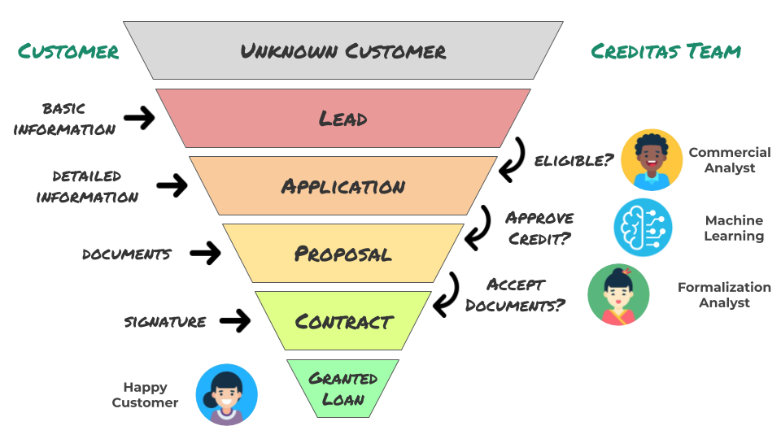
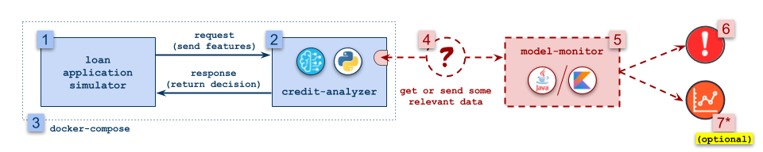

# Creditas Machine Learning Engineering Challenge

## Introduction

Hi! We're glad to know you intend to work with us in the Creditas Data Engineering team. It means a lot you're taking time to do this programming assignment! :smiley:

This challenge mimics a task we face in our daily routine at Creditas and it was designed to assess your coding skills. We expect you to deliver a professional solution, taking into account correctness, performance and code organization. :nerd_face:

### Creditas loan granting process
Granting a loan is a multi-step process that requires gathering customer information and analyzing it to assess the risk involved in the financial operation. While it is always possible to minimize risks simply by raising the taxes we strongly believe that this is not a good approach for building a responsible, sustainable and profitable business. That is why we focus on secured loans, in which risks are diminished for us and taxes are better for customers.

A secured loan is a much more complex operation than a non-secured one. We need to collect additional information, both about the customer and the collateral, to enrich the decision making process. The following image illustrates a very simplified and hypothetical version of the process we have here at Creditas.

The process starts when the customer shows interest by providing basic information regarding the loan he/she wants to borrow. To avoid unnecessary bureaucracy and to maximize the customer engagement, we do not ask our clients to fill all the information we need in this first step.

The figure shows on the left side actions the customer takes, and on the right side, decisions our team needs to make along the conversion funnel (it is a funnel because for each further step we look, we will progressively find less and less people involved).

### Automatic decisions
The credit approval decision is made by a machine learning model (see the figure). Needless to say that this kind of automation generates great impact, therefore it is something we are seeking to do more and more to scale our business.

Theoretically, every single decision made in the process can be automated, but when a machine decides what to do with a customer, you'd better be sure it is doing the right thing! Well, here is the problem we want you to deal with: write some code to help ensure this model is doing well in production.

## The problem: monitoring automatic credit approvals

### Credit approval model
To make these credit approval decisions, we have trained a very simple machine learning model, and this is the model you'll have to monitor. The model is a decision tree with the following 4 features:

| feature | type | value range | description |
|---------|------|-------------|-------------|
| `education_level` | categorical | `Illiterate`, `High School`, `Bachelor` or `Master or Doctoral` | the highest education level degree obtained by the customer |
| `profession_type` | categorical | `clt`, `aposentado`, `freelancer` | the type of employment contract currently held by the customer |
| `loan_amount` | integer | usually from 10,000 to 50,000 | the loan amount requested by the customer in BRL |
| `monthly_income` | integer | usually from 1,500 to 100,000 | the monthly income reported by the customer in BRL |

The output of the model is a float number between 0 and 1, the decision then is made based on the following criteria:

- if the output is equal or higher than `0.65` the credit is ***APPROVED***;
- if the output is lower than `0.4` the credit is ***DENIED***;
- otherwise the decision is not automatically made. In this case, a human analyst should review the data and make the final decision.

Given our previous model analysis, we are expecting this decision tree to make decisions in production within the following proportion:

- `30%` are approved;
- `50%` are denied;
- `20%` are redirected to a human analyst;

(keep this in mind :stuck_out_tongue_winking_eye:)

### Architecture

The figure above illustrates the architecture diagram for this problem. Some parts were already built (shown in blue) and others we expect you to build (shown in red):

1. *`loan-application-simulator`*: this application simulates the caller of the credit analyzer model, firing 10 requests per second against the credit analyzer in a timespan of 90 seconds. It simulates changes in data that is sent to reproduce different conditions.

2. *`credit-analyzer`*: **python** application that loads the `.pkl` file with the trained model and returns the decisions made. It is a simple Flask API with one single endpoint.

3. *`docker-compose.yml`*: we packaged these two applications in a unified docker-compose for you to test and develop your solution.

4. **get or send some relevant data**: in order to monitor this model, we expect you to modify the `credit-analyzer` application to get or send some data that you think is relevant to monitor the model.

5. *`model-monitor`*: **java or kotlin** application that you will build, it must somehow receive data and monitor if the model is doing well in production.

6. *`alerts`*: the `model-monitor` application must trigger alerts when it detects atypical behavior of the model. The mechanism to inform the user that such change occurred can be as simple as printing it to the application log or sending an email, or as sophisticated as you wish.

7. *`metrics`*: build a dashboard to show the metrics evolution over time, you can use whatever you want (optional).

### Monitoring the model

There are many ways to verify how a machine learning model is performing in real life, some uses extra data as a target, some uses evaluation metrics, some relies on human revision, etc. In this challenge ***we expect you to think about how to monitor the `credit-analyzer` within the given context***.

:warning: **DISCLAIMER:** *this was not meant to be complicated!* :warning:

## What you need to do

We want you to implement everything that is shown in red in the architecture figure (parts `4`, `5`, `6` and, optionally, `7`). More specifically, you can follow these steps:

### Define your solution
- Define the metrics you will use to monitor the model behavior
    - Think about how they can express a relevant change in the model behavior;
    - Think about which alerts you will trigger based on these metrics;
    - **Document these choices clearly in your `README` file**;
- **[4]** Think about how to transport the relevant *metrics data* (previous item) from the `credit-analyzer` to `model-monitor` applications.

### Build your solution
- **[4]** Build the metrics data transport from `credit-analyzer` to `model-monitor` applications
    - If you decided to use an external data storage tool, include it in the `docker-compose`;
    - Modify the `credit-analyzer` application (written in `python`) to send/push/write/provide the metrics.
- **[5 and 6]** Build from scratch the `model-monitor` application using _preferably_ **java or kotlin**, it should:
    - Get metrics data;
    - Process and/or aggregate it;
    - Trigger alerts if the metrics represent a change in behavior of the model.
- **[7] (optional)** If you appreciate an extra challenge :wink:, provide a way to visualize and analyze these metrics, here are some ideas you can use (but feel absolutely free to use anything you want):
    - Import CSV into a spreadsheet and provide some charts;
    - Build a webpage using a JS chart library;
    - Process data in a Jupyter Notebook;
    - The sky :cloud: is the limit!

Provide your solution in a single **`docker-compose`** environment, including the possible one or more storage engines that your solution uses.

### Explain your solution
- Explain objectively what you did and how to test your solution in the `README` file
- Answer the following: did your application triggered any alert? If so, how many? At what instant (how many seconds after the application start)? Describe the alerts.

### How to deliver your solution
Create a private GitHub repository and grant access to the user `challenge-dadinho`. Please also reply to the original email with the link to this page informing you submitted your solution.

### How to start
Download this folder, and, inside your local copy, run the following command:
`(cd credit-analyzer; docker-compose up)`

## Hints about us

- We use Linux;
- We use Git;
- We value well written code and good usage of OOP principles;
- We expect your code to work;
- We expect you provide a README and explain how to run your code;
- We love docker, and it would be great if we could test your code just running a docker command;
- We love [markdown](https://guides.github.com/features/mastering-markdown/) in the README;
- We don't bite, so if you have any doubts please contact the recruiter :wink:.

### Our Stack

*You don't need to know or use this, but we would be glad if you do.*

- Kotlin;
- Python;
- Postgres;
- Kafka;
- Docker;
- Schema Registry;
- AVRO;
- S3;
- Grafana.

## Extra questions

This is not part of the challenge, but if you'd like to go further, please provide answers for the following questions in your README. There is no need to code, just explain how you would address the following:

- Which other tools you know that could be useful in solving this very same problem?
- Given an already trained machine learning model, what would you suggest to provide a self-service experience to the Data Science team to deploy models in production?
- What would you suggest to scale your solution to monitor hundreds of models?
- What would you suggest to automatic retrain models that presents change in behavior? What are the concerns involved in doing this?
- How would you modify your solution if some specific models requires sub-second latency on detecting changes in behavior?
