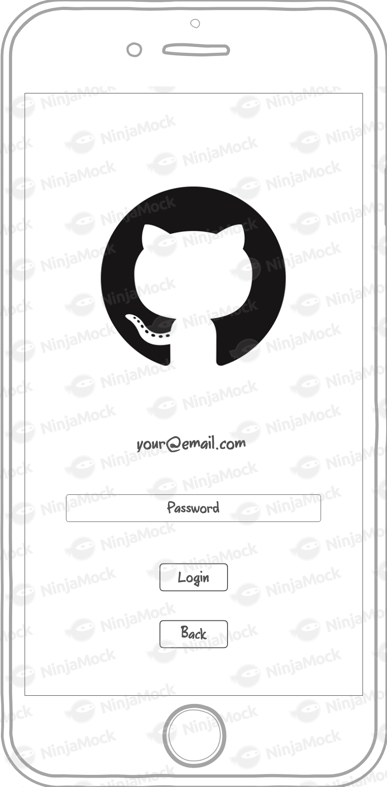
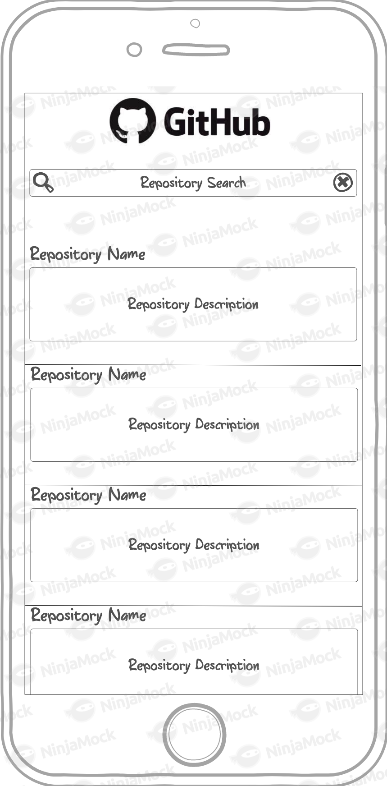
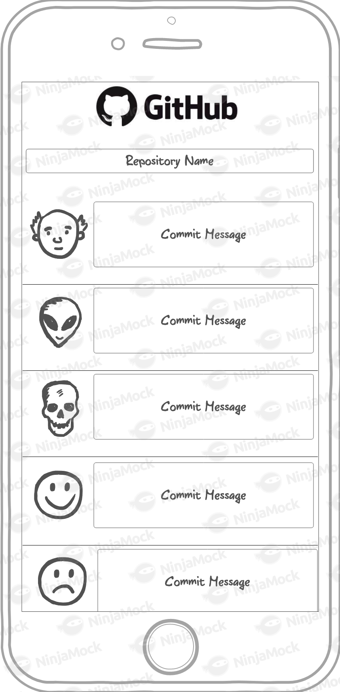

# Mobile React Native Challenge

Este teste é apresentado aos candidatos as vagas de desenvolvedores mobile para avaliar os quesitos técnicos.

## O que é necessário fazer?

Você deverá porototipar um aplicativo client do Github para acompanhar os projetos dos usuários do aplicativo.
Para isso é esperado que o usuário entre com seu login e senha para se autenticar nas APIs do Github.
Após a autenticação deverão ser listados os repositórios existentes desse usuário e ao selecionar um repositório, deverá ser exibida uma listagem com os commits desse dado repositório, ordenado por data.

### O desafio

Para o desafio esperamos um aplicativo client do Github que contem as seguintes features:

- Autenticação via Github API V3 (https://developer.github.com/v3/#authentication)
- Listagem de repositórios (https://developer.github.com/v3/repos/)
- Listagem de commits do repositório (https://developer.github.com/v3/repos/commits/)

## Apresentação

- Explicação da solução via README
- Gif de exemplo utilização do app também no README
- Código do repositório do teste

## Avaliação

Para nos enviar seu código, você pode:

- Fazer um fork desse repositório, e nos mandar uma pull-request.
- Dar acesso ao seu repositório privado no [Gitlab](http://gitlab.com/) para o usuário creditaschallenge.

