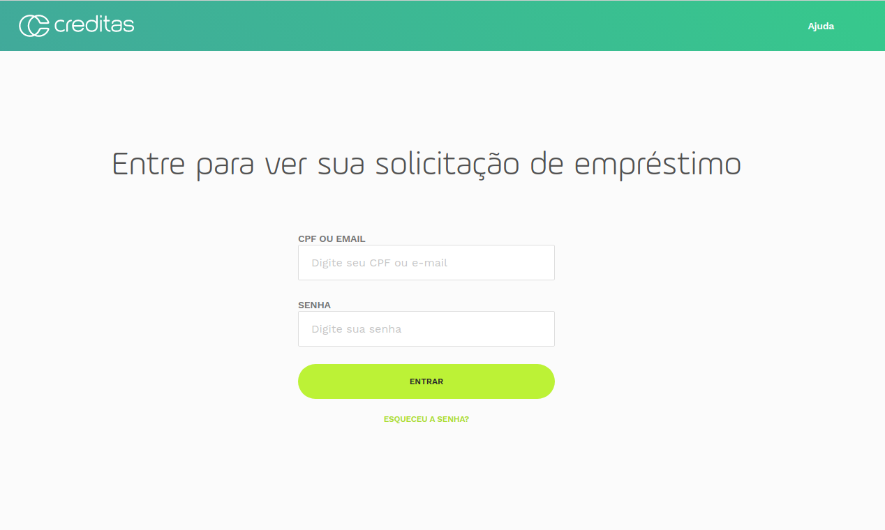

# Desafio para QA - Test Engineer

## O que será avaliado?

Nesse desafio queremos avaliar sua habilidade em especificar/descrever uma funcionalidade de um sistema através do levantamento de cenários/exemplos, além de avaliar o seu conhecimento em automação de testes usando Ruby e Cucumber.

Inclua suas considerações das atividades em um arquivo de texto ou markdown dentro do projeto.

Vamos avaliar tudo que você fizer. Envie o que conseguir terminar, mesmo que você não consiga completar todas as tarefas do desafio. ;-)

**Qual linguagem?** Ruby.

## Desafio

O desafio é composto de 2 tarefas:

1. especificar os cenários de uma funcionalidade.
2. fazer automação dos testes de 3 funcionalidades.

Crie um único projeto para todos os testes automatizados e utilize page-objects para estruturar.

As gems que você irá utilizar ficam a seu critério, mas vale mais pontos usar as mesmas gems que utilizamos aqui na Creditas (Capybara, SitePrism e HTTParty). =)

### 1. Especificação

O Login do site da Creditas está sendo criado agora e o time de desenvolvimento precisa entender melhor como deve funcionar para que possam desenvolver com assertividade. Sua missão é escrever os cenários dessa funcionalidade para guiar o desenvolvimento.

### 2 - Automação de testes funcionais

#### 2.1 Adionar e remover o checkbox

No site abaixo, existe uma funcionalidade que te permite remover e adicionar o checkbox na tela.

https://the-internet.herokuapp.com/dynamic_controls

Crie um cenário de teste automatizado para adicionar e outro para remover o checkbox. Faça as validações necessárias para garantir que o checkbox foi corretamente adicionado/removido.

#### 2.2 Nova aba

No site abaixo temos uma funcionalidade que abre uma nova aba quando você clica no link.

https://the-internet.herokuapp.com/windows

Crie um cenário de teste automatizado que clique no link e valide que a outra aba foi aberta corretamente.

#### 2.3 Criar post via API

A API pública JsonPlaceHolder permite criar posts e comentários.

http://jsonplaceholder.typicode.com/posts

Exemplo de request body:

`"data":{"title":"foo","body":"bar","userId": 1}`

Crie um teste que cria um post através da API. Valide que o post foi criado através do response code e do response body.

# Apresentação

* **Código**
* **Explicação da solução de automação dos testes (em arquivo separado em Markdown/Plain Text)**

# Avaliação

Para nos enviar seu código, você pode:

* Fazer um fork desse repositório, e nos mandar uma pull-request.
* Dar acesso ao seu repositório privado no GitHub ou GitLab para `creditaschallenge`.
